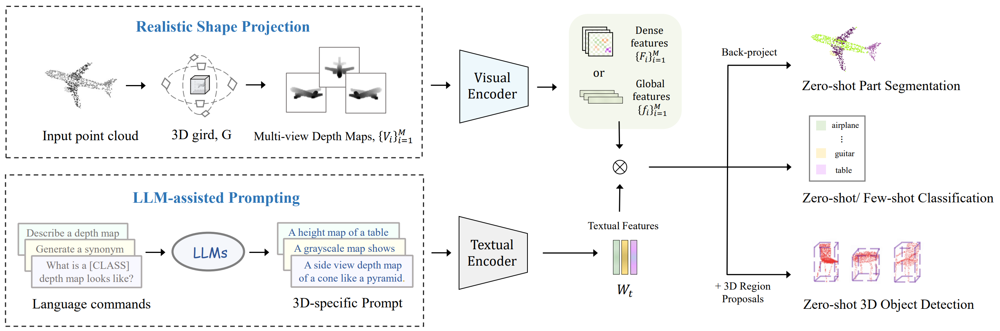

# PointCLIP V2: Prompting CLIP and GPT for Powerful 3D Open-world Learning

Official implementation of [PointCLIP V2: Prompting CLIP and GPT for Powerful 3D Open-world Learning](https://arxiv.org/abs/2211.11682).

The V1 version of [PointCLIP](https://openaccess.thecvf.com/content/CVPR2022/papers/Zhang_PointCLIP_Point_Cloud_Understanding_by_CLIP_CVPR_2022_paper.pdf) accepted by CVPR 2022 is open-sourced at [here](https://github.com/ZrrSkywalker/PointCLIP).

[](https://paperswithcode.com/sota/zero-shot-transfer-3d-point-cloud-2?p=pointclip-v2-adapting-clip-for-powerful-3d)
[](https://paperswithcode.com/sota/training-free-3d-point-cloud-classification-1?p=pointclip-v2-adapting-clip-for-powerful-3d)

## News
* We release the code for zero-shot 3D classification and part segmentation 🔥.
* Check our latest 3D works in **CVPR 2023** 🚀: [Point-NN](https://github.com/ZrrSkywalker/Point-NN) for non-parametric 3D analysis, and [I2P-MAE](https://github.com/ZrrSkywalker/I2P-MAE) for 2D-guided 3D pre-training.

## Introduction
PointCLIP V2 is a powerful 3D open-world learner, which improves the performance of PointCLIP with significant margins. V2 utilizes a realistic shape projection module for depth map generation, and adopts the LLM-assisted 3D prompt to align visual and language representations. Besides classification, PointCLIP V2 also conducts zero-shot part segmentation and 3D object detection.


<!-- Examples of the synthesized depth map and attention map: -->


<!-- The whole framework of PointCLIP V2: -->
<!--  -->


## Code

Please check the `zeroshot_cls` folder for [zero-shot 3D classification](https://github.com/yangyangyang127/PointCLIP_V2/tree/main/zeroshot_cls), and `zeroshot_seg` folder for [zero-shot part segmentation](https://github.com/yangyangyang127/PointCLIP_V2/tree/main/zeroshot_seg).

## Contributors
[Xiangyang Zhu](https://github.com/yangyangyang127), [Renrui Zhang](https://github.com/ZrrSkywalker)


## Citation
Thanks for citing our paper:

```
@article{Zhu2022PointCLIPV2,
    title={PointCLIP V2: Adapting CLIP for Powerful 3D Open-world Learning},
    author={Zhu, Xiangyang and Zhang, Renrui and He, Bowei and Zeng, Ziyao and Zhang, Shanghang and Gao, Peng},
    journal={arXiv preprint arXiv:2211.11682},
    year={2022},
}
```

## Contact
If you have any question about this project, please feel free to contact xiangyzhu6-c@my.cityu.edu.hk and zhangrenrui@pjlab.org.cn.

