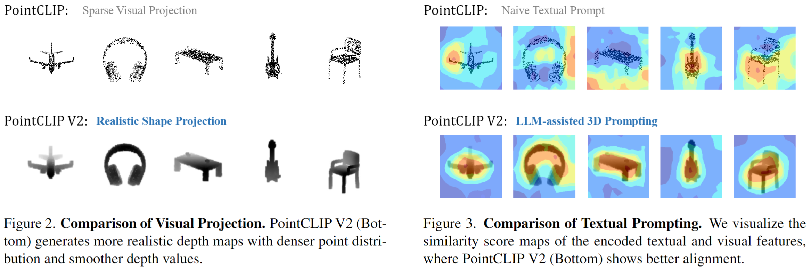
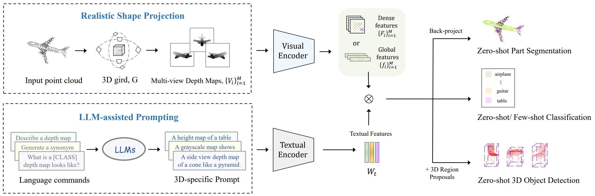

# PointCLIP V2: Adapting CLIP for Powerful 3D Open-world Learning

**PointCLIP V2** is a powerful 3D open-world learner, which improves the performance of PointCLIP with significant margins. V2 utilizes a realistic shape projection module for depth map generation, and adopts the LLM-assisted 3D prompt to align visual and language representations. Besides classification, PointCLIP V2 also conducts zero-shot part segmentation and 3D object detection.

[[`arXiv`](https://arxiv.org/abs/2211.11682)] [[`bibtex`](#Citation)]


<!-- Examples of the synthesized depth map and attention map: -->



<!-- The whole framework of PointCLIP V2: -->
<!--  -->


## Code

We will release the code soon.


## Citation
Thanks for citing our paper:

```
@article{Zhu2022PointCLIPV2,
    title={{PointCLIP V2: Adapting CLIP for Powerful 3D Open-world Learning}},
    author={Zhu, Xiangyang and Zhang, Renrui and He, Bowei and Zeng, Ziyao and Zhang, Shanghang and Gao, Peng},
    journal={arXiv preprint arXiv:2211.11682},
    year={2022},
}
```

